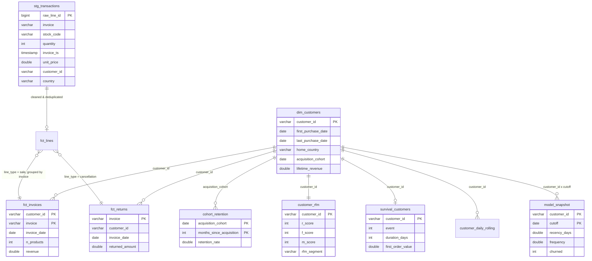

# Entity / data model

```mermaid
erDiagram
    stg_transactions ||--o| fct_lines : "cleaned & deduplicated"
    fct_lines }o--|| fct_invoices : "line_type = sale, grouped by invoice"
    fct_lines }o--|| fct_returns : "line_type = cancellation"
    dim_customers ||--o{ fct_invoices : "customer_id"
    dim_customers ||--o{ fct_returns : "customer_id"
    dim_customers ||--o{ cohort_retention : "acquisition_cohort"
    dim_customers ||--|| customer_rfm : "customer_id"
    dim_customers ||--o| survival_customers : "customer_id"
    dim_customers ||--o{ customer_daily_rolling : "customer_id"
    dim_customers ||--o{ model_snapshot : "customer_id x cutoff"

    stg_transactions {
        bigint raw_line_id PK
        varchar invoice
        varchar stock_code
        int quantity
        timestamp invoice_ts
        double unit_price
        varchar customer_id
        varchar country
    }
    fct_invoices {
        varchar customer_id PK
        varchar invoice PK
        date invoice_date
        int n_products
        double revenue
    }
    fct_returns {
        varchar invoice PK
        varchar customer_id
        date invoice_date
        double returned_amount
    }
    dim_customers {
        varchar customer_id PK
        date first_purchase_date
        date last_purchase_date
        varchar home_country
        date acquisition_cohort
        double lifetime_revenue
    }
    cohort_retention {
        date acquisition_cohort PK
        int months_since_acquisition PK
        double retention_rate
    }
    customer_rfm {
        varchar customer_id PK
        int r_score
        int f_score
        int m_score
        varchar rfm_segment
    }
    survival_customers {
        varchar customer_id PK
        int event
        int duration_days
        double first_order_value
    }
    model_snapshot {
        varchar customer_id PK
        date cutoff PK
        double recency_days
        double frequency
        int churned
    }
```
